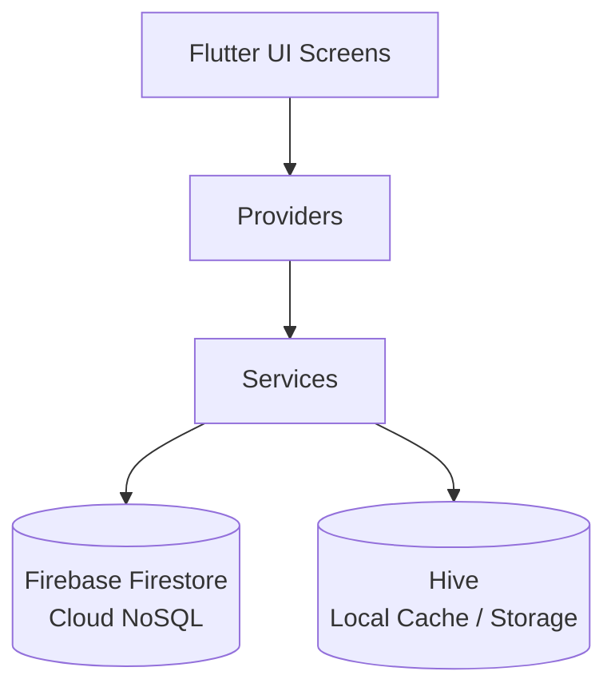
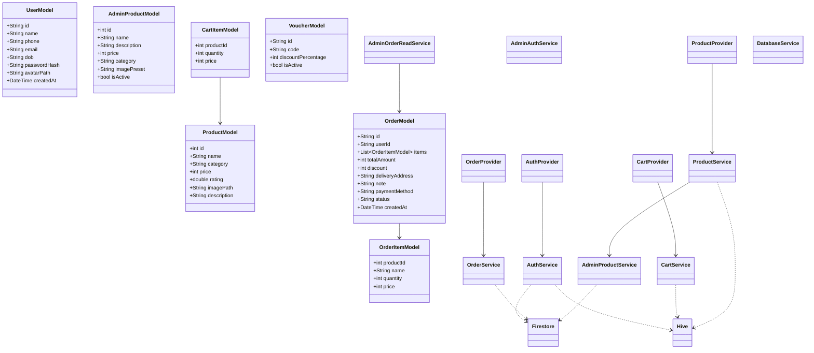
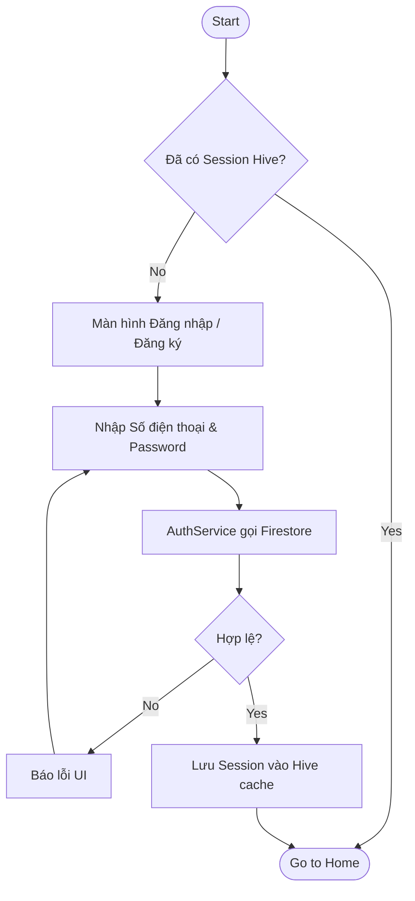
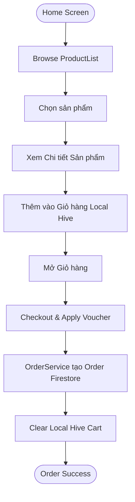
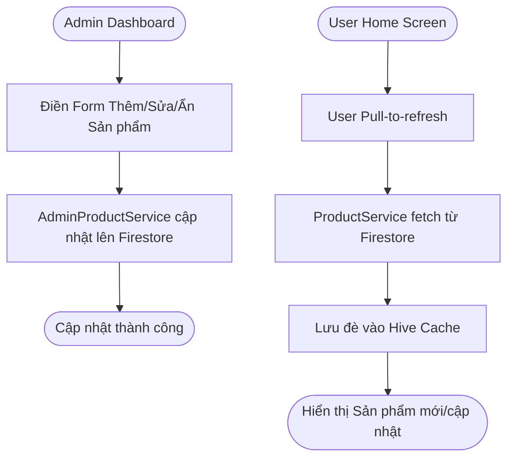
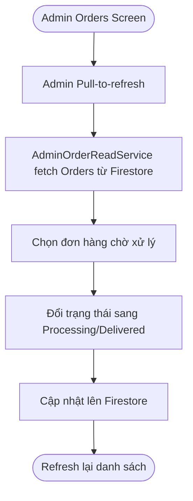
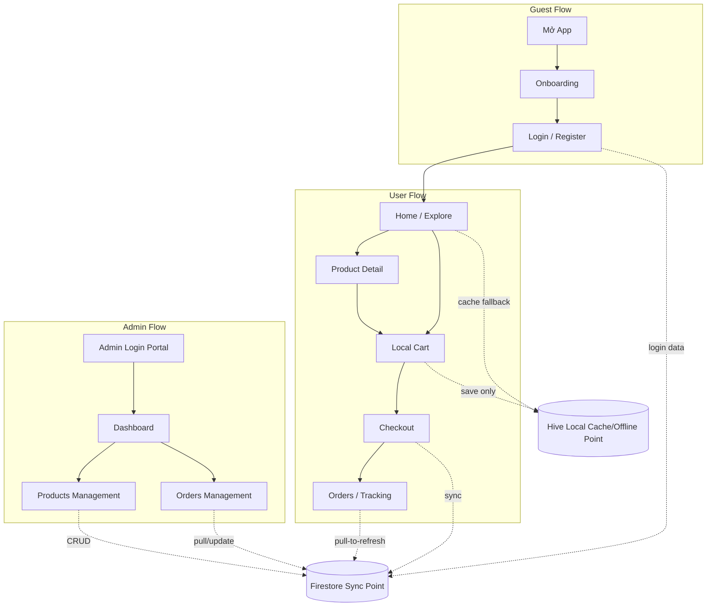

# Thiết kế Hệ thống (Tiêu chí 3)

## 1. Kiến trúc tổng quan

Hệ thống sử dụng Firestore làm cơ sở dữ liệu NoSQL cloud cho các dữ liệu cần đồng bộ giữa thiết bị. Hive được dùng như local cache và local-only storage để hỗ trợ offline fallback, session, theme, cart và favorites.

- Không dùng Firebase Auth native. User đăng nhập bằng số điện thoại và password custom.
- Admin đăng nhập bằng email qua cổng riêng `AdminAuthService`.
- Ứng dụng không sử dụng realtime stream của Firestore để tiết kiệm băng thông. Việc đồng bộ dữ liệu cloud (Cloud Sync) được thực hiện qua các lệnh fetch, manual sync, hoặc Pull-to-refresh.

## 2. Class Diagram

## 3. Activity Diagrams

**1. User Register/Login**

**2. User Browse -> Product Detail -> Cart -> Checkout -> Create Order**

**3. Admin Add/Edit/Hide Product -> Firestore -> User Pull-to-refresh**

**4. Admin Orders -> Pull-to-refresh -> Update Status**

## 4. Flowchart luồng chức năng chính

## 5. Database Design - Firebase Firestore và Hive

### 5.1 Firebase Firestore Cloud NoSQL
Đây là cơ sở dữ liệu cloud chính yếu của ứng dụng phục vụ lưu trữ, chia sẻ và đồng bộ dữ liệu giữa các máy khách và quản trị viên.

- **Collection `users`:**
  - **Document ID:** SĐT của user (phone).
  - **Fields:** `id`, `name`, `phone`, `email`, `dob`, `passwordHash`, `avatarPath`, `createdAt`.
  - **Vai trò:** Đồng bộ tài khoản người dùng với hệ thống xác thực tuỳ chỉnh (Custom Auth). Hệ thống không sử dụng Firebase Auth.
- **Collection `products`:**
  - **Vai trò:** Danh mục món ăn dùng chung và global, được seed sẵn vào db.
  - **Fields:** `id`, `name`, `category`, `price`, `rating`, `imagePath`, `description`.
- **Collection `orders`:**
  - **Document ID:** Tự tạo ngẫu nhiên (UUID hoặc Firestore autoid).
  - **Fields:** `id`, `userId`, `items` (Array), `totalAmount`, `discount`, `deliveryAddress`, `note`, `paymentMethod`, `status`, `createdAt`.
  - **Vai trò:** Đồng bộ hóa đơn đặt món từ user để admin xử lý.
- **Collection `admin_products`:**
  - **Document ID:** ID string của sản phẩm.
  - **Fields:** `id`, `name`, `category`, `price`, `description`, `imagePreset`, `isActive`.
  - **Vai trò:** Chứa danh sách các món ăn do Admin thêm, sửa hoặc ẩn hiện. User khi refresh trang sẽ nhận dữ liệu từ đây.

### 5.2 Hive Local Cache / Local-only Storage
Hive đóng vai trò vô cùng quan trọng như một Local Cache (bộ nhớ tạm) và Local-only Storage, hỗ trợ mạnh mẽ khả năng offline-first của app mobile.

- **Local-only Storage:**
  - `cart`: Lưu các món ăn trong giỏ hàng hoàn toàn offline để phản hồi tức thì, không đồng bộ cloud cho đến lúc checkout.
  - `favorites`: Danh sách món yêu thích lưu cục bộ.
  - `theme/settings`: Sở thích cài đặt của người dùng.
- **Local Cache (Fallback):**
  - `session`: Lưu trạng thái đăng nhập để tự động vào Home, tránh login lại nhiều lần.
  - `products cache`, `orders cache`: Khi mất mạng hoặc server lỗi, Service sẽ đọc Hive fallback để hiển thị UI thay vì báo lỗi trắng màn hình.

## 6. Data Flow / Sync Flow

- **Product Sync Flow:**
  `Firestore` -> `ProductService` (hoặc `AdminProductService`) -> `Hive Cache` (ghi đề) -> `ProductProvider` -> `UI`.
- **Order Sync Flow:**
  User checkout -> `OrderService` lưu vào `Hive` (local) + Đẩy lên `Firestore` (best-effort) -> Admin pull-to-refresh -> `AdminOrderReadService` fetch từ Firestore -> Lưu `Hive` cache -> Báo UI hiển thị.
- **Offline Fallback Flow:**
  Yêu cầu `Firestore` thất bại (hoặc không có mạng) -> Bắt Exception -> Service đọc dữ liệu dự phòng từ `Hive` -> `Provider` -> Vẫn hiển thị được `UI`.
