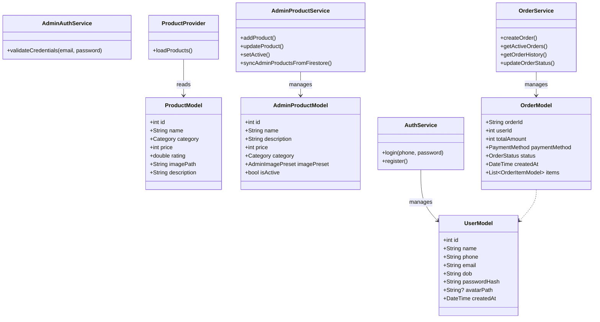
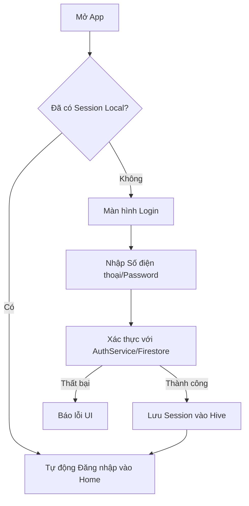
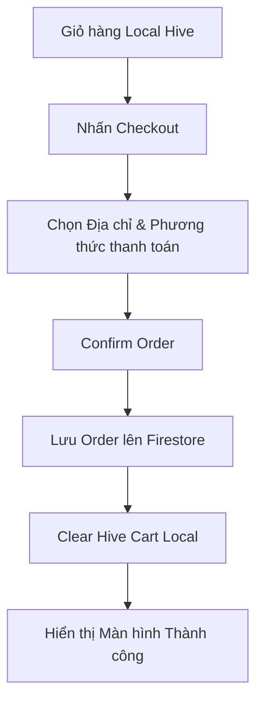

# Thiết kế Hệ thống (Tiêu chí 3)

## 1. Architecture Overview (Tổng quan Kiến trúc)
Dự án PKA Food sử dụng kiến trúc State Management bằng `Provider`, tuân theo mô hình phân lớp rõ ràng nhằm tách biệt giao diện (UI) và logic nghiệp vụ.
- **Presentation Layer (UI/Screens):** Các Widget Flutter hiển thị dữ liệu và nhận tương tác từ người dùng.
- **Provider Layer (State Management):** Nhận sự kiện từ UI, gọi Service để xử lý logic, sau đó gọi `notifyListeners()` để update UI.
- **Service Layer:** Chứa logic nghiệp vụ, giao tiếp với các kho dữ liệu (Firebase / Hive).
- **Data/Model Layer:** Các định dạng class model biểu diễn dữ liệu của hệ thống.

## 2. Thiết kế Hybrid (Firestore + Hive Local-First)
- **Firestore (Cloud):** Firestore là nguồn đồng bộ cloud cho dữ liệu cần chia sẻ giữa thiết bị. Lưu trữ: `users`, `products`, `orders`, `admin_products`. Ứng dụng không sử dụng realtime stream mà yêu cầu thao tác Pull-to-refresh để đồng bộ dữ liệu. Không dùng native Firebase Auth.
- **Hive (Cache/Fallback/Local State):** Dùng để lưu trữ bộ nhớ đệm (Cache), lưu cấu hình ứng dụng (Theme, Session), và đặc biệt là lưu Giỏ hàng (Cart) và Yêu thích (Favorites) hoàn toàn cục bộ để tối đa hóa hiệu năng và tránh phụ thuộc mạng internet.

## 3. Class Diagram (Sơ đồ Lớp)


## 4. Activity Diagrams (Sơ đồ Hoạt động)

### 4.1. Login / Register Flow (Dùng SĐT)


### 4.2. Checkout / Create Order Flow


### 4.3. Admin Product Sync Flow
```mermaid
graph TD
    A[Admin Login - qua AdminAuthService] --> B[Vào Quản lý Sản phẩm]
    B --> C[Fetch từ collection 'admin_products' (Pull to refresh)]
    C --> D[Hiển thị danh sách (kể cả món ngưng phục vụ isActive = false)]
    D --> E[Admin tạo Sản phẩm mới hoặc ẩn món]
    E --> F[Ghi cập nhật vào Firestore]
    F --> G[Cập nhật UI Admin]
```
